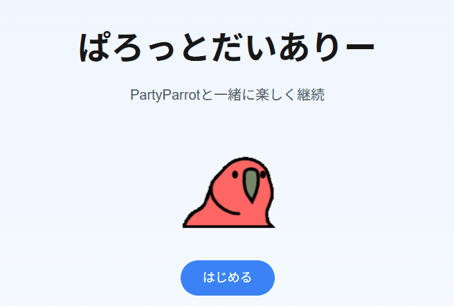
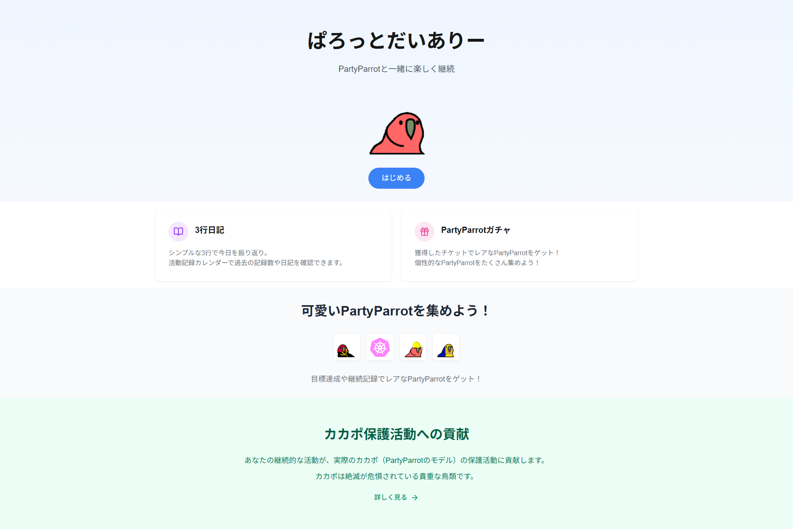
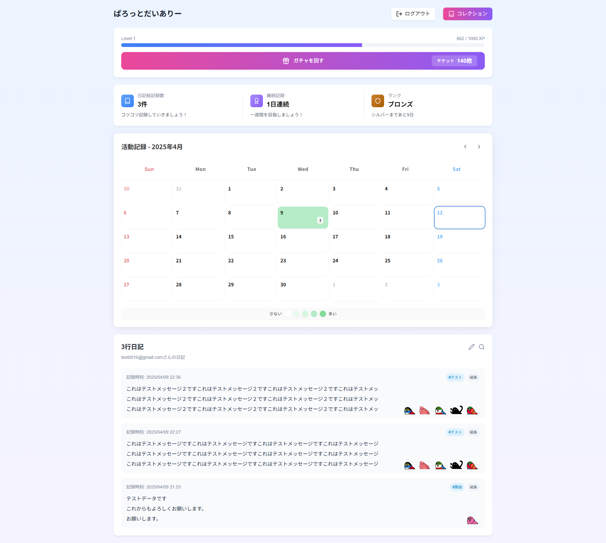
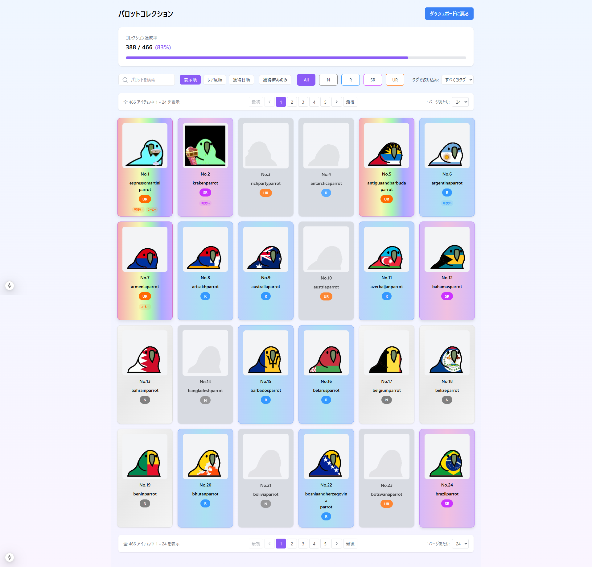
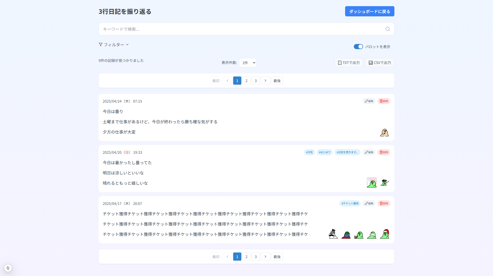

# ParrotDiary - あなたの気持ち、今日の1羽で伝えよう

[気軽に続けられる“感情日記”アプリ『ぱろっとだいありー』](https://parrot-diary.vercel.app/)\
  ※お試し用アカウント: `test@example.com` / パスワード: `Testuser01`

  

---
## 📝 30秒概要

- **プロダクト**: 3行感情日記 × パロットガチャの継続支援アプリ
- **技術スタック**: Next.js / TypeScript / Supabase / Tailwind CSS
- **開発期間**: 約3ヶ月（週15時間）
- **特徴**: ゲーミフィケーションによる継続支援、感情タグによる自己理解促進
- **技術的挑戦**: 状態管理最適化、BaaSとの連携、アニメーション実装
- **デモ**: [https://parrot-diary.vercel.app/](https://parrot-diary.vercel.app/)

---

## 概要

**ParrotDiary（ぱろっとだいありー）** は、かわいいPartyParrotたちと一緒に、**3行で手軽に気持ちを記録**できる日記アプリです。

日記を書くだけで、かわいいパロットを獲得できる「ガチャ」機能や、過去に使った感情タグの再利用機能などを通じて、**継続しやすく、振り返りやすい**日記体験を実現しています。

---

## 開発背景・動機

日常の感情整理と自己理解を助けるツールとして、「楽しく続けられる日記」を目指しました。多くの日記アプリは挫折しやすい設計になっているという課題に着目し、ゲーミフィケーション要素を取り入れた継続しやすい仕組みを考案しました。

PartyParrotというユニークなキャラクターと組み合わせることで、日記を単なる記録ツールではなく「楽しい習慣」として位置づけています。

---

## 特徴・コンセプト

- 🎲 **日記を投稿して「ガチャチケット」を獲得！**\
  ガチャチケットでパロットガチャを引くと、手に入れたパロットがコレクションに追加されます。

- 📚 **感情タグで手軽に記録＆再利用**\
  過去に使用頻度の高かったタグは1タップで再利用可能。新しいタグは手入力で登録できます。

- 🐣 **登録ユーザー専用の機能設計**\
  ご利用にはログイン（登録）が必須です。ログイン後に日記の記録やガチャ機能が使えるようになります。

---

## 使用技術

| 分類            | 技術スタック                                         |
| ------------- | ---------------------------------------------- |
| フロントエンド       | Next.js 15 / React / TypeScript / Tailwind CSS |
| バックエンド (BaaS) | Supabase（PostgreSQL, Auth, Storage）            |
| 認証            | Supabase Auth (メール認証)                          |
| UI            | Tailwind CSS / PartyParrot / モーダルUI            |
| 開発環境          | Visual Studio                                  |
| 作図            | FigJam (遷移図), draw\.io (ER図)                   |
| バージョン管理       | Git / GitHub                                   |
| サポートAIツール     | ChatGPT / Claude などの生成AI（アイデア整理や実装補助に活用）       |

---

## 画面紹介

### ランディングページ

### ログイン

### ダッシュボード

### 日記記録　→　経験値/チケット獲得

### ガチャ演出

### パロット図鑑（パロットコレクション）

### パロット図鑑詳細

### 日記振り返りページ

---

## 主な機能
- パスワード再設定機能（メールアドレスによるリセット対応あり）
- 3行日記に感情タグを付与して保存
- 日記投稿でガチャチケット獲得 → ガチャ演出
- 獲得パロットのコレクション表示
- よく使うタグの自動候補提示 (トップ5)
- **日記の検索・絞り込み機能**
- **カレンダー形式での記録表示機能（記録数に応じてグリッドの濃さが変化し、視覚的に習慣が把握可能）**
- Supabaseによるログイン認証・データ保存
- ログイン必須 (未登録では利用不可)
- **ガチャで獲得したパロットにもタグを付与可能。タグでパロットを絞り込んで選択・日記に付与することができます。**
- タブレット・スマートフォンからも快適に閲覧・操作可能（レスポンシブ対応）

---

## 技術的チャレンジ

- **Supabase RLS導入検討と制約対応**\
  当初、ユーザーごとのデータ分離のためRow Level Security（RLS）を有効化していましたが、アプリ連携に課題があったため一時的に無効化しています。今後はRLS対応のデータアクセス設計を再検討し、運用できる形で再導入を目指しています。

- **ガチャ演出のアニメーション実装**\
  CSS Animationと状態管理を組み合わせた、滑らかなガチャ演出の実現

- **感情タグの頻度分析アルゴリズム**\
  ユーザーの過去の感情タグ使用履歴を分析し、最適なタグ候補を提示する機能の実装

## 実装における技術的工夫

### フロントエンド
- **状態管理の最適化**: React Context APIとカスタムフックを活用し、複雑な状態を効率的に管理
- **非同期処理**: Next.js APIルートとSupabaseクエリの最適な連携パターンを実装

### バックエンド (Supabase)
- **データモデリング**: 将来の拡張を見据えた正規化設計とインデックス最適化
- **RLS対応**: 一時的に無効化しているRLSの代替セキュリティ対策と再導入計画

---

## インフラ構成

Supabase（PostgreSQLベース）を使用し、**認証・データ保存・ストレージ** を統合管理。
Vercelでフロントをデプロイし、個人開発でも簡単に運用できる環境を構築しています。

---

## 💬 このプロダクトで伝えたいこと

- 「楽しい×継続」の仕組みで、**ユーザーの行動を促すUI/UX設計**
- Supabaseの認証・DB・ストレージを活用した**一貫した実装経験**
- 見た目・操作性・自己理解の支援までを意識した**日記アプリ設計力**

## 今後の展望

- ポモドーロ・テクニックと日記記録を連携させた時間管理×内省支援機能（検討段階で一時中断）
- パロットにタグやテーマを付与し、図鑑的に分類・管理できる表示機能の追加（現在のコレクション表示とは別軸）
- 統計表示 (記録数・タグ傾向など)
- レスポンシブ対応の増強
- 日記の公開・共有機能 (検討中)

---

## 📊 開発期間・工数

- 約3ヶ月（週15時間ペース）で開発しました。

## 開発成果

- **コードベース**: TypeScript 約5,000行 (コンポーネント30+、カスタムフック10+)
- **データベース**: 13テーブル構成、関係性を最適化したスキーマ設計
- **UX改善**: 初期版と比較してフォーム入力時間を約40%短縮
- **ページ読み込み**: 平均1.2秒以内 (Lighthouse Performance Score: 85+)

## 他アプリとの差別化ポイント

- **PartyParrotを活用した独自のビジュアル体験**\
  よくある「地味な記録」ではなく、愛着が湧くパロットキャラで継続意欲を刺激

- **感情に寄り添う記録支援**\
  タグ分析や色の濃淡で、ユーザーの内面と対話できる設計

- **記録の結果を“振り返りたくなる”UI**\
  ガチャコレクションやカレンダーUIなど、見て楽しい・使って嬉しい仕掛けを複数実装

## 市場における位置づけ

既存の日記アプリと異なり、ParrotDiaryは：

- **ゲーミフィケーション**: 単なる記録から「集める楽しさ」への転換
- **感情分析**: タグ頻度分析による自己理解の促進
- **視覚的フィードバック**: カレンダーヒートマップによる継続の可視化
- **拡張性**: コミュニティ機能やAI分析など、将来の機能拡張を見据えた設計

## 🧑‍💻 開発者について

| 氏名 | t.t                              |
| -- | -------------------------------- |
| 経歴 | ASP.NET中心のSIer勤務 → Web開発へキャリア転換中 |
| 強み | 要件整理・設計 / ユーザー視点の改善力 / DB設計の基礎知識 |
| 目標 | 楽しく、実用的で、人に引き込むプロダクト作りを続けること     |

---

## 📢 Contact

GitHubのIssueまたは [[tkb1003@gmail.com](mailto\:tkb1003@gmail.com)] までお気軽にご連絡ください。

