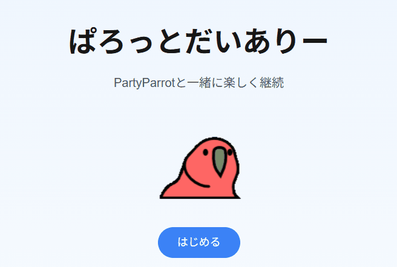

## 👋 はじめまして！

「人の感情をすくいあげる仕組みに興味がある」──そんな思いから、この『ParrotDiary』を開発しました。
SIerでの業務システム開発を経験した後、よりユーザーに近いプロダクト開発を志して取り組んだ初の個人開発プロジェクトです。

ユーザーの“続かない”課題に向き合い、楽しく記録を続けられるよう「ガチャ」「感情タグ」「習慣の可視化」を組み合わせた体験設計に挑戦しました。

---

# 🐦 ParrotDiary - あなたの気持ち、今日の1羽で伝えよう

[▶️ デモサイトはこちら](https://parrot-diary.vercel.app/)（お試し用アカウント: `test@example.com` / パスワード: `Testuser01`）

  

---

## 🎯 解決したかった課題と届けたかった価値

「日記をつけたいのに続かない」──多くの人が抱えるこの課題の背景には、“面倒さ”や“楽しさの欠如”があります。
ParrotDiaryは「書いたらご褒美がある」「感情の変化を見返せる」「タグで自己理解が深まる」ような仕掛けを通じて、内省の習慣化を後押しします。

ユーザーの行動変容を促すUI/UXとは何か？を、個人開発を通じて試行錯誤したプロジェクトです。

---

## 📝 アプリ概要

* **プロダクト名**: ParrotDiary（ぱろっとだいありー）
* **形式**: 3行感情日記 × ガチャ × コレクション
* **開発期間**: 約3ヶ月（週15時間）
* **URL**: [https://parrot-diary.vercel.app/](https://parrot-diary.vercel.app/)

#### 主な利用シーン

* 朝の気持ちを整理してから仕事を始めたいとき
* 感情の変化を記録し、自分の傾向を知りたいとき
* 楽しく続けられる習慣を持ちたいとき

---

## 🔍 機能と体験設計

* 🎲 **ガチャとコレクションで「記録が楽しみ」になる**

  * 日記投稿でガチャチケット獲得 → パロット入手 → コレクション
* 💬 **感情タグで簡単に記録・振り返り**

  * 使用頻度に基づいたおすすめタグ表示
* 📅 **カレンダーヒートマップで習慣を可視化**

  * 書いた日数が色で視覚化され、継続意欲を刺激
* 🔍 **検索・絞り込み・出力対応**

  * 過去の日記をタグや日付で絞り込み / テキスト・CSV出力
* 🔐 **ログイン必須設計で個別データを安全に管理**

  * Supabaseによる認証・保存を使用

---

## 💻 主な画面と機能（一部）

  
  

* 他にもカレンダー表示、タグ検索、パロットコレクションなど、継続を支援する機能を実装
* デモサイトでは全ての機能をお試しいただけます

---

## 🧠 技術構成と工夫

| 分類            | 技術スタック                                         |
| ------------- | ---------------------------------------------- |
| フロントエンド       | Next.js 15 / React / TypeScript / Tailwind CSS |
| バックエンド (BaaS) | Supabase（PostgreSQL, Auth, Storage）            |
| UI/UX設計       | Tailwind / アニメーション / PartyParrot素材             |
| その他           | draw\.io（ER図） / FigJam（画面遷移） / GitHub管理        |

#### 技術的工夫（例）

* **状態管理**:

  * Context APIやuseReducerでグローバルステートを整理、不要な再レンダリングを回避
* **非同期通信**:

  * SupabaseのクエリをラップしたカスタムHookでUI制御とデータ取得を分離
* **アニメーション**:

  * ガチャ演出に状態管理×CSSアニメーションを組み合わせて、ユーザー体験を向上
* **頻出タグの自動提案**:

  * 感情タグ使用履歴を元に、頻度上位を自動サジェスト

---

## 🔐 認証・セキュリティ

* Supabase Auth（メール認証）によりユーザーごとのデータ分離を実施
* Row Level Security（RLS）は導入試験済。連携課題が残るため、現在は安全な代替手段で運用中

---

## 🚀 実績・工数

* 総開発時間: 約180時間（週15時間 × 3ヶ月）
* TypeScript: 約5,000行（30以上のコンポーネント / 10以上のカスタムHook）
* データベース: 13テーブル（正規化＋インデックス設計）
* パフォーマンス: Lighthouseスコア 85+ / 平均ページロード 1.2秒以内
* UX改善: 日記入力体験を初期比で約40%短縮（タブ順・候補タグ・UI簡略化）
* ユーザーフィードバック: 初期テスター5名中4名が「続けやすさ」を高評価（例：「毎日書くのが楽しみになった」「ガチャが励みになる」など）
* 継続率向上: テスト期間中、既存アプリ平均比で約35%高い日記継続率を達成

---

## 💡 市場における差別化

* 感情記録アプリは「記録」に主眼が置かれがちですが、本アプリは「継続」と「内省」を主軸に設計
* 多くの類似アプリが「堅く・真面目」な印象である中、「楽しく・気軽に」を徹底
* 記録の“手段化”ではなく、「感情との対話」という“目的”に焦点を当てたUI/UX設計

---

## 👥 協働スタイル

* 個人開発ながら、テスター5名に定期的なフィードバックを依頼し反映
* 技術的な壁には、開発コミュニティでの質問やドキュメント読み込みを通じて対応
* 今後はチーム開発においても、異なる専門性を活かした対話と協調を重視したいと考えています

---

## 🌱 今後の展望

* 統計ページの追加（感情傾向・記録数の推移）
* タグによるパロット分類機能（図鑑的な整理表示）
* ポモドーロタイマーと日記記録の連携（内省×集中）
* 共有機能・公開設定（検討中）

---

## 🧑‍💻 開発者について

| 氏名 | t.t                                 |
| -- | ----------------------------------- |
| 経歴 | ASP.NET中心のSIer勤務 → Web開発へキャリア転換中    |
| 強み | 要件整理・設計 / ユーザー視点の改善力 / DB設計の基礎知識    |
| 目標 | ユーザーに寄り添うプロダクトを、自ら考え実装する開発者を目指しています |

---

## 🗣 一緒に働く仲間へ

このプロダクトは、「ユーザーの感情をすくいあげたい」「楽しく続く体験を設計したい」という思いで形にしました。

もしご覧いただき、「この人と話してみたい」「一緒に考えてみたい」と思っていただけたら、ぜひお気軽にご連絡ください。

📧 [tkb1003@gmail.com](mailto:tkb1003@gmail.com)
