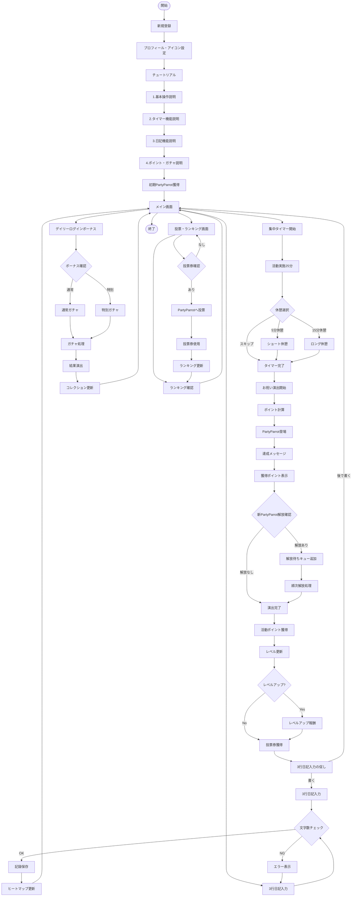

```mermaid
graph TD
    Start([開始]) --> Register[新規登録]
    Register --> Profile[プロフィール・アイコン設定]
    
    Profile --> Tutorial[チュートリアル]
    Tutorial --> Tut1[1.基本操作説明]
    Tut1 --> Tut2[2.タイマー機能説明]
    Tut2 --> Tut3[3.日記機能説明]
    Tut3 --> Tut4[4.ポイント・ガチャ説明]
    Tut4 --> InitialParrot[初期PartyParrot獲得]
    InitialParrot --> MainMenu[メイン画面]
    
    MainMenu --> Timer[集中タイマー開始]
    Timer --> Activity[活動実施25分]
    Activity --> Break{休憩選択}
    Break -->|5分休憩| ShortBreak[ショート休憩]
    Break -->|15分休憩| LongBreak[ロング休憩]
    Break -->|スキップ| TimerComplete[タイマー完了]
    ShortBreak --> TimerComplete
    LongBreak --> TimerComplete
    
    TimerComplete --> InitCelebration[お祝い演出開始]
    InitCelebration --> CalcPoints[ポイント計算]
    CalcPoints --> ShowParrot[PartyParrot登場]
    ShowParrot --> DisplayMessage[達成メッセージ]
    DisplayMessage --> ShowPoints[獲得ポイント表示]
    ShowPoints --> CheckUnlock{新PartyParrot解放確認}
    CheckUnlock -->|解放あり| UnlockQueue[解放待ちキュー追加]
    CheckUnlock -->|解放なし| CompleteCelebration[演出完了]
    UnlockQueue --> ProcessUnlock[順次解放処理]
    ProcessUnlock --> CompleteCelebration
    
    CompleteCelebration --> Points[活動ポイント獲得]
    Points --> UpdateLevel[レベル更新]
    UpdateLevel --> CheckLevelUp{レベルアップ?}
    CheckLevelUp -->|Yes| LevelUpReward[レベルアップ報酬]
    CheckLevelUp -->|No| GetVoteTicket[投票券獲得]
    LevelUpReward --> GetVoteTicket
    GetVoteTicket --> PromptDiary[3行日記入力の促し]
    PromptDiary -->|書く| DiaryFromTimer[3行日記入力]
    PromptDiary -->|後で書く| MainMenu
    
    MainMenu --> DiaryMenu[3行日記入力]
    DiaryMenu --> ValidateInput{文字数チェック}
    DiaryFromTimer --> ValidateInput
    ValidateInput -->|OK| SaveRecord[記録保存]
    ValidateInput -->|NG| ShowError[エラー表示]
    ShowError --> DiaryMenu
    SaveRecord --> UpdateHeatmap[ヒートマップ更新]
    UpdateHeatmap --> MainMenu
    
    MainMenu --> DailyLogin[デイリーログインボーナス]
    DailyLogin --> CheckBonus{ボーナス確認}
    CheckBonus -->|通常| NormalGacha[通常ガチャ]
    CheckBonus -->|特別| SpecialGacha[特別ガチャ]
    NormalGacha --> ProcessGacha[ガチャ処理]
    SpecialGacha --> ProcessGacha
    ProcessGacha --> ShowGachaResult[結果演出]
    ShowGachaResult --> Collection[コレクション更新]
    Collection --> MainMenu
    
    MainMenu --> VoteRanking[投票・ランキング画面]
    VoteRanking --> ViewRanking[ランキング確認]
    VoteRanking --> CheckVoteTickets{投票券確認}
    CheckVoteTickets -->|あり| VoteParrot[PartyParrotへ投票]
    CheckVoteTickets -->|なし| VoteRanking
    VoteParrot --> UseTicket[投票券使用]
    UseTicket --> UpdateRanking[ランキング更新]
    UpdateRanking --> ViewRanking
    ViewRanking --> MainMenu
    
    MainMenu --> Exit([終了])
```