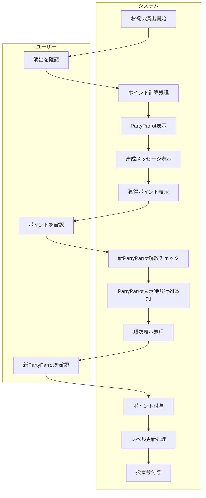

```mermaid
flowchart TD
    subgraph システム
        A[お祝い演出開始]
        B[ポイント計算処理]
        C[PartyParrot表示]
        D[達成メッセージ表示]
        E[獲得ポイント表示]
        F[新PartyParrot解放チェック]
        G[PartyParrot表示待ち行列追加]
        H[順次表示処理]
        I[ポイント付与]
        J[レベル更新処理]
        K[投票券付与]
    end

    subgraph ユーザー
        L[演出を確認]
        M[ポイントを確認]
        N[新PartyParrotを確認]
    end

    A --> L
    L --> B
    B --> C
    C --> D
    D --> E
    E --> M
    M --> F
    F --> G
    G --> H
    H --> N
    N --> I
    I --> J
    J --> K
```