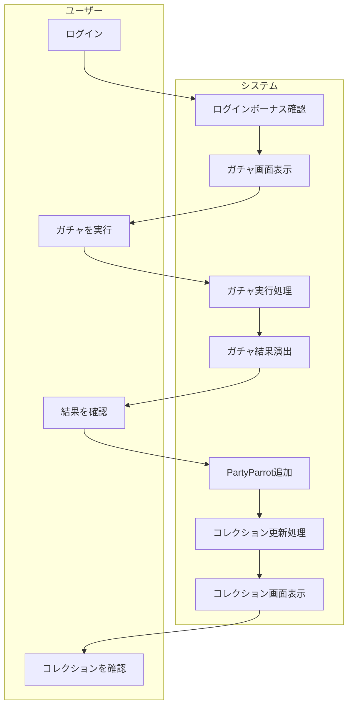

```mermaid
flowchart TD
    subgraph システム
        A[ログインボーナス確認]
        B[ガチャ画面表示]
        C[ガチャ実行処理]
        D[ガチャ結果演出]
        E[PartyParrot追加]
        F[コレクション更新処理]
        G[コレクション画面表示]
    end

    subgraph ユーザー
        H[ログイン]
        I[ガチャを実行]
        J[結果を確認]
        K[コレクションを確認]
    end

    H --> A
    A --> B
    B --> I
    I --> C
    C --> D
    D --> J
    J --> E
    E --> F
    F --> G
    G --> K
```