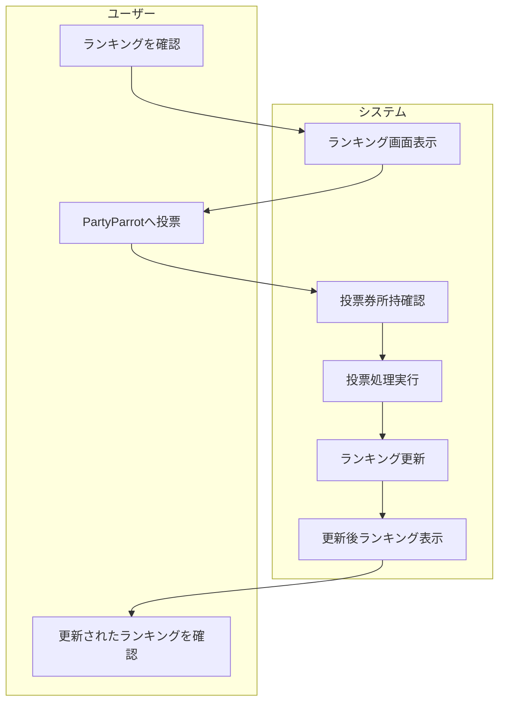

```mermaid
flowchart TD
    subgraph システム
        A[ランキング画面表示]
        B[投票券所持確認]
        C[投票処理実行]
        D[ランキング更新]
        E[更新後ランキング表示]
    end

    subgraph ユーザー
        F[ランキングを確認]
        G[PartyParrotへ投票]
        H[更新されたランキングを確認]
    end

    F --> A
    A --> G
    G --> B
    B --> C
    C --> D
    D --> E
    E --> H
```